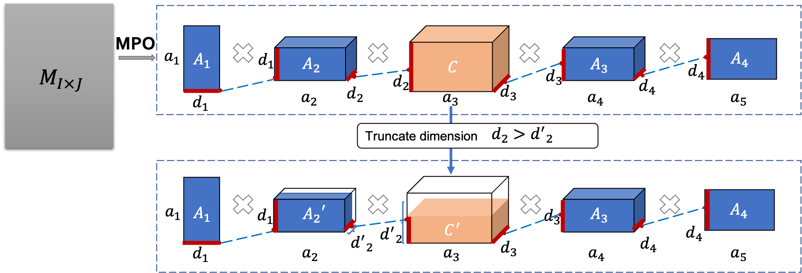

# Enabling Lightweight Fine-tuning for Pre-trained Language Model Compression based on Matrix Product Operators
Here we present a novel pre-trained language models (PLM) compression approach based on the matrix product operators (short as MPO) from quantum many-body physics.
It can decompose an original matrix into central tensors (containing the core information) and auxiliary tensors (with only a small proportion of parameters). With the decomposed MPO structure, we propose a novel fine-tuning strategy by only updating the parameters from the auxiliary tensors, and design an optimization algorithm for MPO-based approximation over stacked network architectures. Our approach can be applied to original or compressed PLMs in a general way, which derives a lighter network and significantly reduces the parameters to be fine-tuned. 

Extensive experiments have demonstrated the effectiveness of the proposed approach in model compression, especially the reduction in fine-tuning parameters (91% reduction on average).


 
 
Details and code is coming soon...
 # Release Notes
 First version: 2021/05/21

 # Installation
 ```shell
pip install -r requirements.txt
 ```
## Lightweight fine-tuning
In lightweight fine-tuning, we use original ALBERT without fine-tuning as to be compressed. By performing MPO decomposition on each weight matrix, we obtain four auxiliary tensors and one central tensor per tensor set. This provides a good initialization for the task-specific distillation.

```shell
# run lightweight finetuning
```
## Dimension squeezing
In Dimension squeezing, we compute approiate truncation order for the whole model. In order to re-produce the results in paper, we prepare the model after lightweight fine-tuning.

```shell
# run dimension squeezing
```

## TODO
- [ ] prepare data and code
- [ ] upload models in order to reproduce experiments
- [ ] supplementary details for paper